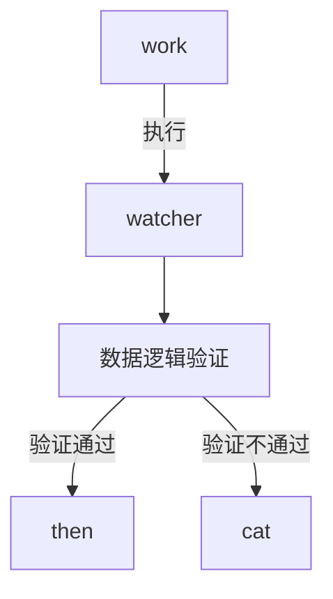

# Action Flow

Action Flow是一个轻量，快速的流程引擎框架。

## 为什么有 Action Flow

从宏观角度来看随着微服务架构逐渐成为WEB后端架构的主流，在微服务架构中通常会将服务拆分的越来越细，对于后端而言这些微服务之间相对独立，但是这些独立服务还需要通过聚合服务将其进行组合才能够达成某项业务的实际实现，随着时间推移聚合服务的数量会日益增多，这些众多的聚合服务所需要的维护成本也会随之增加。
从微观角度来看单个服务（应用）的研发方式一般会采取最小粒度的实现各个核心业务服务，然后在外层组装出符合业务的处理流程，随着时间推移这些业务流程所在的类会日益增多，这些众多的类所需要的维护成本也会随之增加。

站在宏观角度和微观角度可以发现这些核心操作无非就是REST_API调用或者函数的调用，它们的多种组合通过程序代码将其进行固化（如果需要修改需要通过改变程序代码）。面对这样的问题 Action Flow 项目想要通过一定的可视化配置的方式将其进行管理，从而适当降低微服务架构中聚合服务的数量，以及在单体应用中将组合业务的形式通过可视化的方式进行配置，从而适当减少单体服务中的大量组合性质的类。

## Action Flow 设计思想
在 Action Flow 项目中将执行流程做出了三个核心对象。
1. action: 用于定义需要执行的具体行为，行为包含JAVA函数,HTTP请求。
2. flow: 用于定义执行流程。
3. result: 用于定义某个执行流程的结果。

在上述三个对象中最重要的是flow对象，它需要承担整个执行链路的定义工作，层级结构: work->watcher->then\cat

>  TIPS：在上述执行流程中then和cat都存储work，支持嵌套使用。

## 快速开始

- [ ] 快速开始文档编写

  - [ ] XML模式

    - [ ] JAVA函数调用
    - [ ] HTTP接口调用
    - [ ] HTTP接口和JAVA函数混用

  - [ ] WEB模式

    - [ ] JAVA函数调用
    - [ ] HTTP接口调用
    - [ ] HTTP接口和JAVA函数混用

    